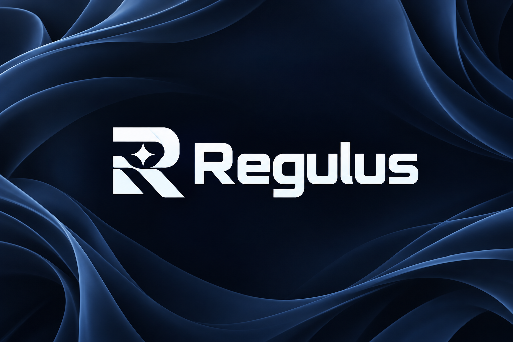
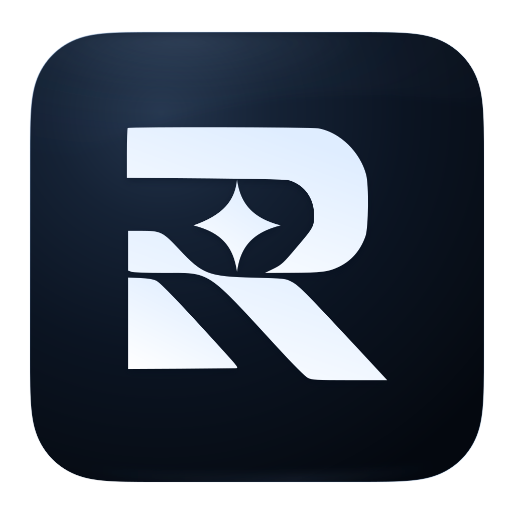

# Regulus



> Un host de módulos con interfaz visual para construir, conectar y operar sistemas de
> agentes de IA. Absorbe código ajeno y lo hace propio, sin perder la capacidad de
> quitarlo.

**Estado:** diseño. No hay código de aplicación todavía. Ver [`docs/05-roadmap.md`](docs/05-roadmap.md).

## Identidad visual

El monograma combina una **R** con una estrella de cuatro puntas, en referencia a
Regulus. El icono de la aplicación coloca ese mismo trazado sobre un cuadrado azul
noche oscuro, con esquinas redondeadas estilo iPhone y reflejos azul acero sutiles.
Tanto el logo como el icono son SVG autocontenidos:
no dependen de fuentes instaladas ni contienen imágenes incrustadas.

<p align="center">
  
</p>

| Asset | Archivo listo para usar |
|---|---|
| Logo horizontal · vector transparente | [regulus-logo.svg](assets/branding/regulus-logo.svg) |
| Logo horizontal · PNG transparente, 1832 × 422 | [regulus-logo.png](assets/branding/regulus-logo.png) |
| Icono de app · vector transparente | [regulus-app-icon.svg](assets/branding/regulus-app-icon.svg) |
| Icono de app · PNG transparente, 1024 × 1024 | [regulus-app-icon.png](assets/branding/regulus-app-icon.png) |
| Icono de app · PNG transparente, 256 × 256 | [regulus-app-icon-256.png](assets/branding/regulus-app-icon-256.png) |
| Icono Windows / favicon · ICO, 16–256 px | [regulus-app-icon.ico](assets/branding/regulus-app-icon.ico) |
| Presentación original · PNG, 1536 × 1024 | [regulus-logo-concept-v1.png](assets/branding/regulus-logo-concept-v1.png) |

El logo blanco está preparado para fondos oscuros; su fondo es transparente.
La paleta utiliza azul noche `#0A1424`, azul acero `#587BA7` y blanco frío `#F3F8FF`.

El archivo maestro es `assets/branding/regulus-logo.svg`. El generador toma de él
el monograma para mantener el icono y el logo sincronizados. Para reconstruir el
icono SVG y las exportaciones, con Python 3, Inkscape e ImageMagick instalados:

```sh
python3 assets/branding/build_assets.py
```

### Paleta y UI kit

La dirección visual es **Regulus Midnight**: superficies grafito del tema oscuro de
Centaury y acentos azules del icono de Regulus. La recomendación
es **shadcn/ui + Base UI**, con componentes personalizados para Regulus.

- [Guía de diseño y comparación de kits](docs/08-design-system.md).
- [Paleta y tokens maestros (JSON)](assets/design/palette.json).
- [Variables CSS](assets/design/tokens.css) y [tema shadcn/Tailwind](assets/design/shadcn-theme.css).
- [Muestra visual local](assets/design/preview.html): abrir en un navegador.

El kit todavía no está instalado. Los colores y estilos están listos para su integración.

---

## Qué leer según lo que vayas a hacer

| Si vas a… | Lee |
|---|---|
| Entender por qué existe Regulus | [`docs/01-vision.md`](docs/01-vision.md) |
| Tocar el core, el workspace o el stack | [`docs/02-architecture.md`](docs/02-architecture.md) |
| Escribir un módulo | [`docs/03-modules.md`](docs/03-modules.md) |
| Diseñar o implementar la UI | [`docs/04-client.md`](docs/04-client.md) |
| Saber qué toca ahora y qué está decidido | [`docs/05-roadmap.md`](docs/05-roadmap.md) |
| Elegir una dependencia o versión | [`docs/06-stack.md`](docs/06-stack.md) |
| Saber qué herramientas ya existen (ACP, MCP) | [`docs/07-ecosystem.md`](docs/07-ecosystem.md) |
| Comprobar un dato sobre Orca o hcom | [`docs/research.md`](docs/research.md) |
| Commitear, ramificar o empujar | [`docs/09-git.md`](docs/09-git.md) |
| Proponer algo todavía no decidido | [`docs/ideas/`](docs/ideas/) |

**Agentes con tarea delegada:** lee `01-vision.md` completo, luego tu brief en
`05-roadmap.md` §Briefs. No empieces nada marcado como bloqueado.

## Antes de tu primer commit

```bash
scripts/install-hooks.sh     # una vez por clon: activa los hooks de .githooks/
```

El repo valida los mensajes de commit (Conventional Commits), busca credenciales y revisa
el rango antes de cada push. Las reglas están en [`docs/09-git.md`](docs/09-git.md) y la
configuración, editable sin tocar código, en [`.gitconventions`](.gitconventions).

---

## Las tres ideas que hay que entender

1. **Doctrina Predator** — un módulo no es un plugin de terceros. Es código ajeno
   absorbido y reescrito para ser nativo de Regulus. Pero absorbido ≠ fundido: sigue
   siendo quitable. [`01-vision.md` §2](docs/01-vision.md)

2. **Dos límites, no uno** — clientes ↔ core hablan por **socket**; core ↔ módulos
   hablan por **trait Rust in-process**. Confundirlos es el error a evitar.
   [`02-architecture.md` §1](docs/02-architecture.md)

3. **Matriz de ablación** — con N módulos, Regulus arranca N veces quitando uno cada
   vez. Es lo que convierte "puedes quitar cosas" de promesa en hecho verificado.
   [`03-modules.md` §4](docs/03-modules.md)

---

## Convención

Los documentos marcan su contenido así:

| Marca | Significado |
|---|---|
| ✅ **DECIDIDO** | Definido por Alexander. No lo cuestiones, constrúyelo. |
| 🔶 **PROPUESTO** | Recomendación con razonamiento. Necesita aprobación. |
| ❓ **ABIERTO** | Nadie lo ha decidido. **No lo inventes.** Pregunta. |
